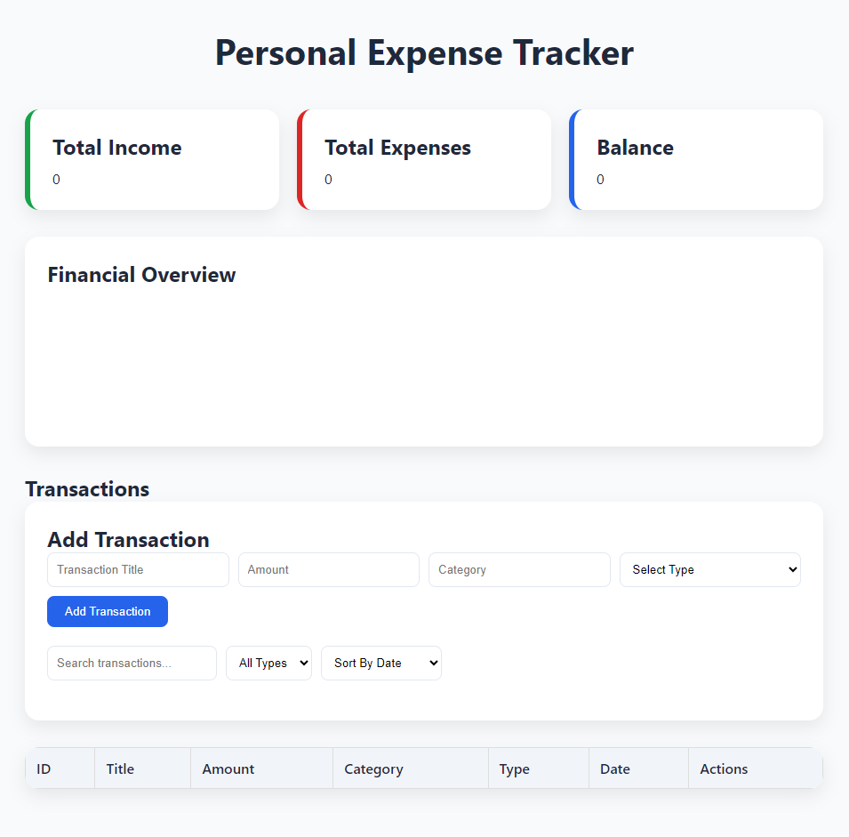
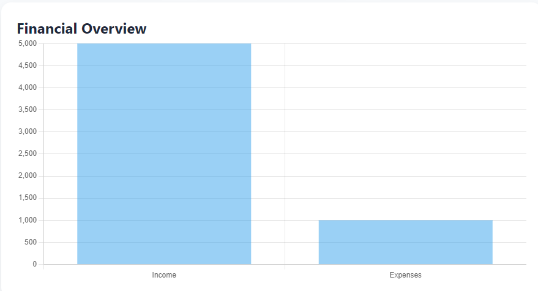
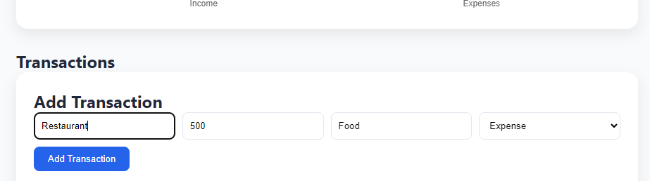
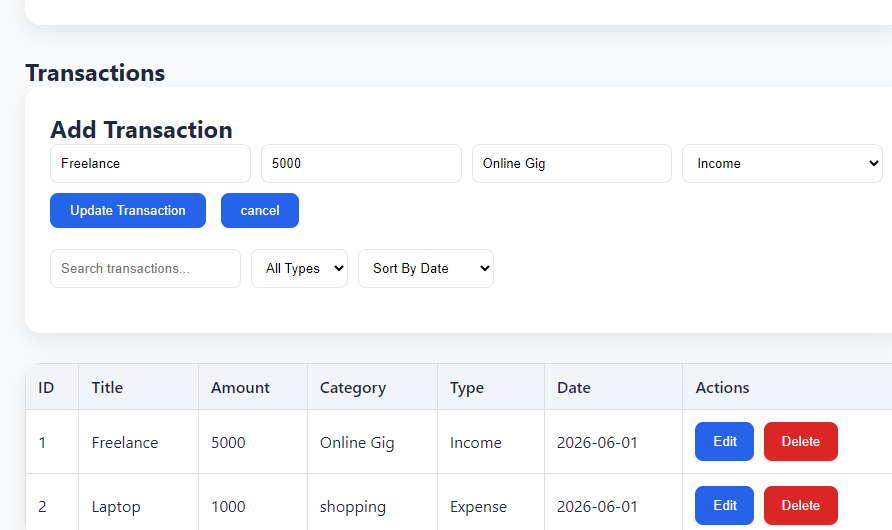

# Personal Expense Tracker API + Dashboard


A full-stack expense tracking application built with FastAPI, SQLAlchemy, SQLite, HTML, CSS, and JavaScript.

This project allows users to manage income and expenses through a modern dashboard while providing REST API endpoints for transaction management and financial analytics.

---

## Features

### Backend

* FastAPI REST API
* SQLAlchemy ORM
* SQLite Database
* Pydantic Validation
* CRUD Operations
* Financial Summary Endpoint

### Frontend

* Responsive Dashboard
* Create Transactions
* Edit Transactions
* Delete Transactions
* Search Transactions
* Filter by Transaction Type
* Sort by Date
* Sort by Amount
* Financial Analytics Chart
* Real-Time Updates

### Analytics

* Total Income
* Total Expenses
* Current Balance
* Chart.js Visualization

---

## Tech Stack

### Backend

* Python 3.13
* FastAPI
* SQLAlchemy
* SQLite
* Pydantic

### Frontend

* HTML5
* CSS3
* JavaScript (ES6)
* Chart.js

### Development Tools

* Git
* GitHub
* Uvicorn
* Pytest

---

## Project Structure

expense-tracker/

├── app/

│   ├── database/

│   ├── models/

│   ├── routes/

│   ├── schemas/

│   ├── services/

│   └── main.py

│

├── frontend/

│   ├── index.html

│   ├── styles.css

│   └── script.js

│

├── tests/

├── README.md

├── TESTING.md

└── requirements.txt

---

## Installation

### Clone Repository
```bash
git clone https://github.com/FidelCoder7/personal-expense-tracker.git

cd expense-tracker

### Create Virtual Environment

python -m venv .venv

### Activate Environment

Windows:

.venv\Scripts\activate

### Install Dependencies

pip install -r requirements.txt

### Run Application

uvicorn app.main:app --reload

Backend:

http://127.0.0.1:8000

Swagger Documentation:

http://127.0.0.1:8000/docs

---

## API Endpoints

### Transactions

GET /transactions

GET /transactions/{id}

POST /transactions

PUT /transactions/{id}

DELETE /transactions/{id}

### Analytics

GET /transactions/summary

---

## Future Improvements

* User Authentication
* PostgreSQL Integration
* Export to CSV
* Monthly Reports
* Budget Planning
* Category Analytics
* Docker Deployment
* Cloud Hosting

---

## Testing

Run tests using:

pytest

See TESTING.md for the complete manual testing checklist.

---

## Learning Outcomes

This project demonstrates:

* REST API Design
* Backend Development
* Database Design
* ORM Usage
* Frontend Development
* Async JavaScript
* CRUD Operations
* Data Visualization
* Software Testing
* Git & GitHub Workflow

## Screenshots

### Dashboard



### Financial Chart



## Create Transaction


## Edit Transaction


## Search-Filter
